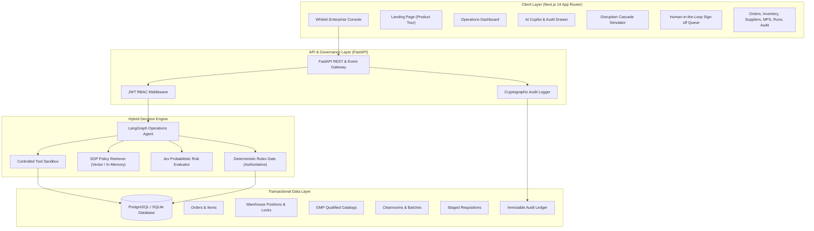
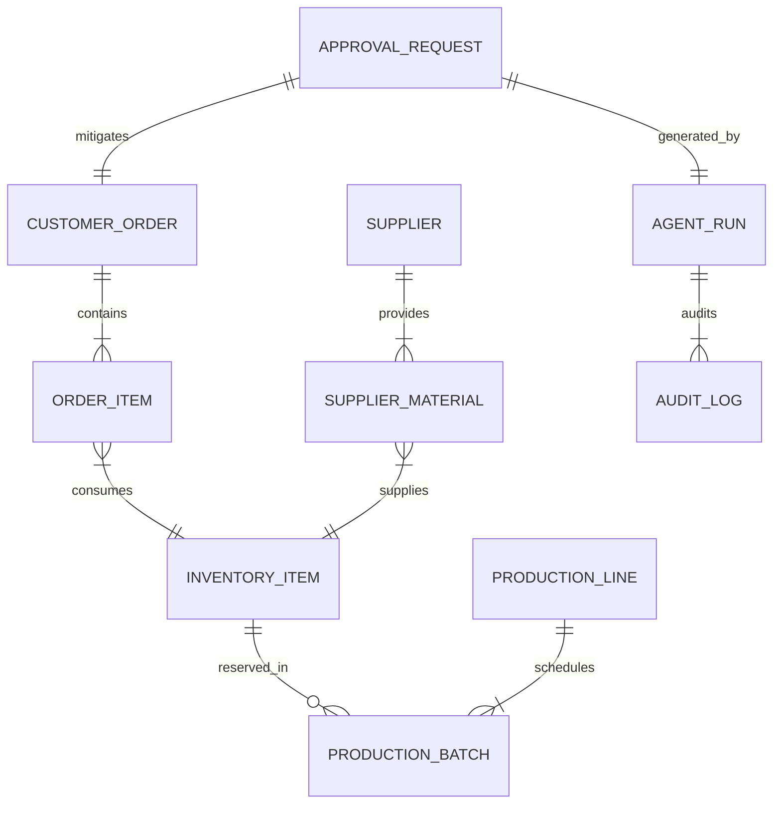
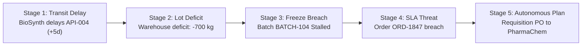

# SupplyPilot — Master Technical & Architectural Documentation

> **Autonomous AI Operations & Supply Chain Decision-Support Platform for Pharmaceutical & Industrial Manufacturing**

---

## Table of Contents
1. [Executive Overview & Vision](#1-executive-overview--vision)
2. [Core Architectural Philosophy](#2-core-architectural-philosophy)
3. [System Architecture & Component Diagram](#3-system-architecture--component-diagram)
4. [Data Domain & Database Schema](#4-data-domain--database-schema)
5. [The Hybrid Decision Engine](#5-the-hybrid-decision-engine)
   - [5.1 LangGraph Autonomous Reasoning Agent](#51-langgraph-autonomous-reasoning-agent)
   - [5.2 Standard Operating Procedure RAG System](#52-standard-operating-procedure-rag-system)
   - [5.3 Jev Probabilistic Risk Assessment](#53-jev-probabilistic-risk-assessment)
   - [5.4 Deterministic Rules Engine & Invariant Supremacy](#54-deterministic-rules-engine--invariant-supremacy)
6. [The 5-Stage Disruption Cascade Simulation](#6-the-5-stage-disruption-cascade-simulation)
7. [Human-in-the-Loop (HITL) Governance & RBAC](#7-human-in-the-loop-hitl-governance--rbac)
8. [Backend Implementation (FastAPI)](#8-backend-implementation-fastapi)
   - [8.1 Domain Services](#81-domain-services)
   - [8.2 Tool Ecosystem (Read & Action)](#82-tool-ecosystem-read--action)
   - [8.3 REST API Endpoints](#83-rest-api-endpoints)
9. [Frontend Implementation (Next.js 14)](#9-frontend-implementation-nextjs-14)
   - [9.1 Whitish Enterprise Design System](#91-whitish-enterprise-design-system)
   - [9.2 Application Routes & User Interfaces](#92-application-routes--user-interfaces)
   - [9.3 State Management & Backend Integration](#93-state-management--backend-integration)
10. [Auditability, Compliance & Safety Guardrails](#10-auditability-compliance--safety-guardrails)
11. [Setup, Deployment & Operational Runbook](#11-setup-deployment--operational-runbook)

---

## 1. Executive Overview & Vision

Modern pharmaceutical and high-reliability industrial manufacturing environments operate under immense operational friction. When a chemical precursor is delayed at an international border, the shockwave ripples across multiple isolated organizational silos:
- **Procurement** scrambles to locate certified secondary suppliers.
- **Warehouse Logistics** attempts to locate reserve safety buffers or locked lot allocations.
- **Production Planning** must decide whether to idle a multimillion-dollar cleanroom line or violate sterile freeze windows.
- **Customer Success** faces impending delivery default penalties and regulatory breach liabilities.

Historically, organizations have relied on either rigid, fragile ERP automation or disconnected spreadsheets and manual email chains. 

**SupplyPilot** redefines enterprise operational management by providing an **autonomous, end-to-end intelligence and decision-support layer** that connects the operational dots:

$$\text{Supplier Disruption} \longrightarrow \text{Stock Deficit} \longrightarrow \text{Cleanroom Freeze Breach} \longrightarrow \text{Customer SLA Risk} \longrightarrow \text{Actionable Mitigation}$$

The platform does not merely answer questions; it observes data changes in real time, diagnoses root causes, retrieves governing regulatory SOPs, calculates net component shortfalls, evaluates alternate suppliers, and **stages authorized, deterministic interventions for human sign-off**.

---

## 2. Core Architectural Philosophy

SupplyPilot is architected around a single foundational axiom:

$$\mathbf{\text{LLMs propose and reason; deterministic systems verify and execute.}}$$

In regulated environments (e.g., FDA 21 CFR Part 11, EU Annex 11, SOC-2), an autonomous LLM must never possess unconstrained database mutation privileges or financial authority. To prevent confabulations and catastrophic financial errors, SupplyPilot enforces strict boundaries:

1. **Language Interpretation & Hypothesis Generation:** Managed by an LLM-powered LangGraph workflow.
2. **Transactional State of Truth:** Managed by an ACID-compliant SQL database (PostgreSQL / SQLite).
3. **Contextual Norms & Regulatory Policies:** Managed by vector retrieval (RAG) referencing verbatim Standard Operating Procedures.
4. **Deterministic Invariant Supremacy:** Hard business logic, role-based access control (RBAC), and financial authorization limits execute in pure Python outside LLM tokens and cannot be bypassed.
5. **Probabilistic Risk Scoring:** The Jev AI Gateway scores operational uncertainty, supplier reliability, and evidence completeness.
6. **Immutable Accountability:** Every automated hypothesis, policy citation, and human approval signature is permanently recorded in an append-only audit trail.

---

## 3. System Architecture & Component Diagram

The SupplyPilot platform consists of a modern, decoupled client-server architecture:



---

## 4. Data Domain & Database Schema

The core domain model reflects an enterprise sterile pharmaceutical synthesis facility (**PharmaPulse Synthetics, Facility C-4**):



### Table Definitions & Invariants

1. **`orders` & `order_items`**:
   - Tracks commercial delivery contracts (e.g. `ORD-1847` for Medix Logistics, delivering 10,000 vials of Paracetamol 500mg by October 20, 2026).
   - Fields: `order_number`, `customer_name`, `status`, `total_amount`, `delivery_deadline`, `priority`.
2. **`inventory_items`**:
   - Represents physical stock in sterile vault storage (e.g. `API-004` Paracetamol active pharmaceutical ingredient).
   - Invariant: $\text{Available} = \text{On Hand} - \text{Reserved}$.
   - Flags: `is_below_safety_stock`, `warehouse_location` (`Vault-C4`).
3. **`suppliers` & `supplier_materials`**:
   - GMP-certified chemical vendor registry with historical reliability metrics and dual-sourcing eligibility.
   - Key entities: **BioSynth Corp** (primary, 82% SLA, delayed) vs **PharmaChem Labs** (secondary approved, 96% SLA, available).
4. **`production_lines` & `production_batches`**:
   - ISO-5 / Class A sterile manufacturing lines (`Line 1 Sterile Compounding`).
   - Fields: `batch_number`, `line_id`, `scheduled_start_date`, `scheduled_end_date`, `status` (`SCHEDULED`, `STALLED_SHORTAGE`).
   - Enforces a 48-hour freeze window prior to batch compounding.
5. **`approval_requests`**:
   - Staged purchase requisitions or schedule amendments pending authorized human signature.
   - Fields: `id`, `action_type`, `payload`, `status` (`PENDING`, `APPROVED`, `REJECTED`), `estimated_cost`, `governance_role_required`.
6. **`audit_logs`**:
   - Append-only compliance ledger recording actor identity, action type, cryptographic payload snapshot, timestamp, and regulatory SOP rationale.

---

## 5. The Hybrid Decision Engine

### 5.1 LangGraph Autonomous Reasoning Agent
The operations agent (`backend/app/agent/graph.py`) is structured as a directed state graph:
- **`plan_step`**: Parses the operational goal, breaks it into structured sub-tasks, and evaluates progress.
- **`reason_step`**: Analyzes the accumulated scratchpad and decides whether to query data, check SOPs, or propose an action.
- **`execute_tools`**: Invokes strongly typed domain tools in a sandboxed execution loop.
- **`evaluate_policy`**: Queries RAG for governing organizational regulations.
- **`evaluate_jev`**: Calls the Jev advisory service for risk analysis.
- **`apply_rules`**: Submits the proposal to the deterministic rules gate.
- **`generate_response`**: Formats the final executive brief with structured data artifacts.

### 5.2 Standard Operating Procedure RAG System
Verbatim enterprise procedures are indexed at the granular section level:
- **`SOP-PRC-001` (Procurement Authority Limits):**
  - Section 2.1: Autonomous approvals permitted for purchases $\le €5,000$.
  - Section 2.2: Requisitions between $€5,000$ and $€25,000$ require Procurement Officer approval.
  - Section 2.3: Requisitions $> €25,000$ mandate Operations Director authorization.
- **`SOP-PRC-002` (Dual-Sourcing & Alternative Vendors):**
  - Governs expedited raw material sourcing during primary supplier delivery defaults.
- **`SOP-PRD-003` (Production Scheduling & Cleanroom Freezes):**
  - Imposes a strict 48-hour schedule lock prior to compounding to prevent particulate contamination.
- **`SOP-SUP-002` (Supplier Quality Hold):**
  - Unconditionally blocks procurement from suppliers placed on delinquent or regulatory hold.

### 5.3 Jev Probabilistic Risk Assessment
Hosted via Vercel AI Gateway, Jev evaluates unstructured operational nuances:
- **Risk Score ($0-100$):** Measures the systemic probability of delivery failure.
- **Confidence Rating ($0-1.0$):** Quantifies evidence completeness across supplier SLA and batch history.
- **Human Escalation Advisory:** Flags low confidence or abnormal lead times for mandatory manual verification.

### 5.4 Deterministic Rules Engine & Invariant Supremacy
The deterministic rules engine (`backend/app/rules/rules_engine.py`) serves as the immutable floor of the system:

$$\text{Final Human Review Required} = \text{Rule Requirement} \lor \text{Jev Escalation}$$

Even if an LLM or Jev recommends autonomous clearance, the deterministic engine enforces the hard financial authority tiers and supplier qualification rules. **A probabilistic model can escalate risk, but can never downgrade a hard regulatory invariant.**

---

## 6. The 5-Stage Disruption Cascade Simulation

SupplyPilot features an interactive upstream-to-downstream disruption cascade engine that demonstrates how small variances create catastrophic supply chain failures:



1. **Stage 1 — Upstream Supplier Disruption:** BioSynth Europe reports an unscheduled 5-day transit delay on Purchase Order `PO-9912` for Active Pharmaceutical Ingredient `API-004` (Paracetamol).
2. **Stage 2 — Warehouse Stock Reservation Lockout:** Facility C-4 has 500 kg on hand, but 1,200 kg are committed. Available stock plunges to $-700\text{ kg}$, breaching safety stock thresholds.
3. **Stage 3 — Cleanroom Production Freeze Breach:** Batch `BATCH-104` (10,000 vials) is scheduled for compounding on Cleanroom Line 1. Because component availability falls within the 48-hour freeze window (`SOP-PRD-003`), the MES stalls the batch.
4. **Stage 4 — Customer Delivery SLA Breach:** Customer Order `ORD-1847` (Medix Logistics, valued at $€38,500$) cannot be fulfilled by the contractual deadline of October 20, 2026. Financial penalties of $€1,500/\text{day}$ loom.
5. **Stage 5 — Multi-Agent Mitigation & Requisition Staging:** The agent evaluates qualified alternative suppliers under `SOP-PRC-002`, selects **PharmaChem Labs** (offering 800 kg at $€42.00/\text{kg}$ with 2-day delivery), stages a purchase requisition for $€33,600$, and queues it for Operations Director electronic signature.

---

## 7. Human-in-the-Loop (HITL) Governance & RBAC

SupplyPilot rejects fully unmoderated autonomy in favor of authoritative human sign-off. The platform implements fine-grained Role-Based Access Control (RBAC):

| Persona Name | Title / Role | Authorization Limit | Permitted Actions |
| :--- | :--- | :--- | :--- |
| **Elena Rostova** | Procurement Officer (`procurement_officer`) | $\le €25,000$ | Approve POs up to $€25\text{k}$, query vendor catalogs |
| **Marcus Vance** | Operations Director (`operations_manager`) | Unlimited ($> €25,000$) | Approve high-dollar POs, authorize cleanroom schedule shifts |
| **Dr. Claire Chen** | Quality Auditor (`quality_auditor`) | Read-Only Audit | Inspect immutable ledgers, review SOP citations, verify GMP compliance |
| **Sarah Jenkins** | Supply Chain VP (`executive`) | System-Wide Visibility | Executive oversight, strategic disruption injection, performance KPIs |

When a staged requisition exceeds a user's authorization threshold, the approval action button is dynamically disabled with a clear governance padlock banner detailing the required executive role.

---

## 8. Backend Implementation (FastAPI)

The backend is developed in Python 3.11 using FastAPI and SQLAlchemy 2.0 with asynchronous route handlers.

### 8.1 Domain Services (`backend/app/services/`)
- **`OrderService`**: Manages customer contracts, deadlines, and delivery fulfillment status.
- **`InventoryService`**: Computes real-time available stock positions, vault allocations, and safety stock deficits.
- **`SupplierService`**: Manages qualified vendor catalogs, pricing tiers, lead times, and reliability ratings.
- **`ProductionService`**: Evaluates master batch schedules, cleanroom capacities, and freeze-window compliance.
- **`CascadeService`**: Simulates the 5-stage upstream delay shockwave and calculates financial exposures.
- **`RiskService`**: Detects at-risk orders using multi-factor cross-silo queries.
- **`AuditService`**: Appends tamper-evident audit records to the compliance ledger.

### 8.2 Tool Ecosystem (`backend/app/tools/`)
The LangGraph agent interacts with the operational environment via strictly typed Pydantic tools:

| Tool Name | Type | Description |
| :--- | :--- | :--- |
| `get_order_details` | Read | Retrieves contractual order lines, customer identity, and deadline. |
| `check_inventory_levels` | Read | Inspects warehouse on-hand, reserved, and available stock positions. |
| `get_supplier_catalog` | Read | Queries active and alternative vendors for specified material codes. |
| `get_production_schedule` | Read | Checks batch timelines, assigned lines, and cleanroom statuses. |
| `get_production_line_capacity`| Read | Verifies line capacity hours and scheduled utilization factor. |
| `create_purchase_request_tool` | Action | Stages a formal purchase requisition in `PENDING_APPROVAL` status with idempotency keys. |
| `reschedule_production_tool` | Action | Proposes a cleanroom schedule shift subject to 48hr freeze rules. |
| `draft_customer_notification_tool` | Action | Stages an executive delivery update email for customer review. |

### 8.3 REST API Endpoints

```
GET    /api/v1/health                    -> Service health & database connectivity
GET    /api/v1/dashboard/summary         -> Aggregated operations KPIs and posture
GET    /api/v1/orders                    -> Filtered order fulfillment registry
GET    /api/v1/inventory                 -> Warehouse stock positions & reservation locks
GET    /api/v1/suppliers                 -> GMP certified vendor scorecards & catalogs
GET    /api/v1/production/lines          -> Cleanroom manufacturing line telemetry
GET    /api/v1/production/batches        -> Scheduled batch runs & status
POST   /api/v1/events/simulate-delay     -> Injects 5-day BioSynth supplier delay
POST   /api/v1/agent/run                 -> Executes LangGraph reasoning graph
GET    /api/v1/runs                      -> Historical agent execution sessions
GET    /api/v1/approvals                 -> Staged requisitions awaiting signature
POST   /api/v1/approvals/{id}/decide     -> Authorize or reject staged requisition
GET    /api/v1/audit                     -> Immutable compliance audit ledger
```

---

## 9. Frontend Implementation (Next.js 14)

### 9.1 Whitish Enterprise Design System
The user interface is designed for operational calm, optical precision, and institutional trust, adhering to a **crisp, modern whitish theme**:
- **Background:** Soft whitish Slate-50 (`#F8FAFC`).
- **Surfaces:** Pure White (`#FFFFFF`) with subtle border elevations (`#E2E8F0` hairline borders).
- **Typography:** Deep Slate-900 (`#0F172A`) for high-contrast legibility, pairing `Inter` for prose with `JetBrains Mono` for SKU codes, lot numbers, and latency figures.
- **Accents:** High-saturation status badges (Emerald-700, Amber-700, Rose-700, Purple-700).

### 9.2 Application Routes & User Interfaces

```
frontend/src/app/
├── page.tsx          -> Executive Landing Page (Canvas Network Hero, Interactive Demos)
├── dashboard/        -> Operations Command Console (KPIs, Risk Center, Simulator)
├── agent/            -> AI Copilot Workspace (Live Trace, 6-Tab Audit Drawer)
├── cascade/          -> 5-Stage Interactive Disruption Cascade Visualizer
├── approvals/        -> Human-in-the-Loop Governance Sign-Off Center
├── orders/           -> Order Fulfillment Registry & Threat Analysis Drawer
├── inventory/        -> Warehouse Vault Stock Positions & Reservation Locks
├── suppliers/        -> GMP Certified Vendor Directory & Pricing Catalogs
├── production/       -> Master Production Schedule & Cleanroom Line Telemetry
├── runs/             -> Agent Run Telemetry & Granular Latency Inspector
├── audit/            -> Cryptographic Audit Ledger & State Snapshot Drawer
└── login/            -> 1-Click RBAC Demo Persona Switcher
```

### 9.3 State Management & Backend Integration
- Built with **TanStack React Query v5** for caching, optimistic updates, and background refetching.
- Live integration with all 11 backend endpoints (`http://localhost:8000/api/v1`).
- Global RBAC context (`AuthContext`) managing persistent persona switching and simulated JWT authorization headers.

---

## 10. Auditability, Compliance & Safety Guardrails

To fulfill pharmaceutical validation standards (FDA 21 CFR Part 11 and EU Annex 11), SupplyPilot integrates zero-trust safety controls:

1. **Deterministic Input Sanitization:** Rejects negative quantities, script tags, or malformed enum states via Pydantic v2.
2. **Read-Only Data Isolation:** Analytical read tools operate under parameterized SQLAlchemy queries. The LLM has zero direct SQL write access.
3. **Idempotency Keys:** Every staged purchase order or schedule shift includes a deterministic hash key. Network retries detect duplicates and prevent duplicate financial exposure.
4. **Append-Only Tamper-Evident Ledger:** Audit rows are immutable; corrections require compensatory offsetting ledger events.
5. **Human Override Supremacy:** Human managers can cancel or reject any agent-proposed action with mandatory reason logging.

---

## 11. Setup, Deployment & Operational Runbook

### Prerequisites
- Python 3.11+
- Node.js 18+ and `npm`
- Git

### Backend Initialization
```bash
# 1. Navigate to backend directory
cd backend

# 2. Create and activate virtual environment
python -m venv venv
venv\Scripts\activate   # Windows
# source venv/bin/activate # macOS/Linux

# 3. Install dependencies
pip install -r requirements.txt

# 4. Initialize and seed database
python -m app.db.seeder

# 5. Launch FastAPI server
uvicorn app.main:app --host 0.0.0.0 --port 8000 --reload
```
*Backend runs on `http://localhost:8000` (API Docs at `http://localhost:8000/docs`).*

### Frontend Initialization
```bash
# 1. Navigate to frontend directory
cd frontend

# 2. Install dependencies
npm install

# 3. Build optimized production bundle
npm run build

# 4. Start production server
npm run start
```
*Frontend runs on `http://localhost:3000`.*

---

## 12. Conclusion & Summary

SupplyPilot demonstrates how enterprise AI should be designed: **not as an unconstrained chatbot, but as an auditable, deterministic operational copilot**. 

By uniting **LangGraph autonomous reasoning**, **verbatim regulatory RAG**, **Jev probabilistic risk scoring**, and **inviolable deterministic business rules**, SupplyPilot bridges the gap between AI ingenuity and industrial-grade execution safety.
